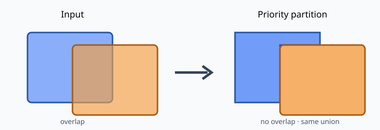

# priorityclip-geo

**Turn overlapping polygons into a deterministic, priority-respecting partition.**



The row with the lowest numeric priority keeps shared area. Later rows receive only
the area not already assigned. Attributes and total union coverage are preserved,
and a CSV audit reports every removed square metre.

## Install

```bash
python -m pip install priorityclip-geo
```

## Use

```bash
priorityclip partition areas.gpkg \
  --layer candidates \
  --priority priority \
  --output partitioned.gpkg \
  --report areas.csv
```

Inputs must be valid Polygon/MultiPolygon features in a projected CRS measured in
metres. Equal priorities retain stable input order. Empty outputs are retained and
reported instead of being silently dropped.

## Python API

```python
from priorityclip import partition

result = partition(geodataframe, "priority")
result.geometries.to_file("partitioned.gpkg")
print(result.report)
```

Copyright 2026 Alena Nikitina. Licensed under the Apache License 2.0.

